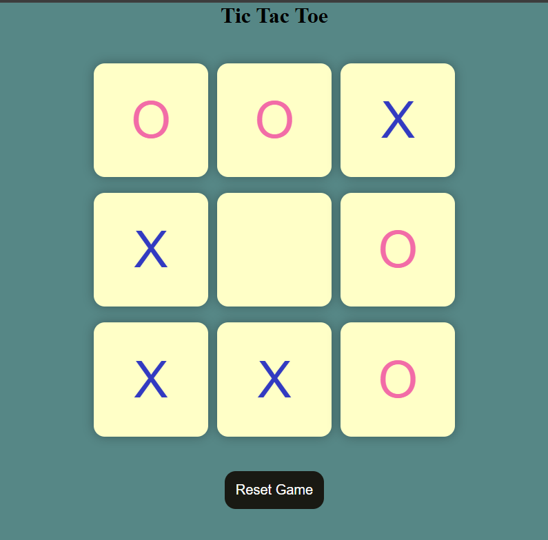

# Tic-Tac-Toe Game

A classic, interactive Tic-Tac-Toe game built from scratch using HTML, CSS, and Vanilla JavaScript. This project showcases DOM manipulation, event handling, and implementing game core logic in JavaScript.

## 🚀 Features

- **Interactive Gameplay:** Fully functioning 3x3 grid letting two players take turns (X and O).
- **Win Detection:** Automatically checks 8 possible winning combinations after every move and displays the result.
- **Dynamic Styling:** Colors uniquely swap depending on whose turn it is (Pink for 'O', Blue for 'X').
- **Reset and New Game Capabilities:** Players can reset an ongoing game or start a new game after a player wins, clearing the board without a page refresh.
- **Responsive Design Unit (`vmin`):** Uses CSS viewport-relative units (`vmin`) to ensure the board accurately sizes and maintains its aspect ratio down to small mobile screens.

## 📂 Project Structure

- `index.html`: Contains the structural UI elements including the message container, the game grid consisting of 9 buttons, and the reset functionality.
- `style.css`: Responsible for visual styling, making use of CSS Flexbox for centering elements and `vmin` units for responsiveness.
- `first.js`: Defines all the functional behavior including turn swapping, winner detection matrices, disable/enable states, and UI updating.

## 🛠️ Technologies Used

- **HTML5:** Semantic markup.
- **CSS3:** Flexbox and Custom Colors.
- **JavaScript (Vanilla):** DOM manipulation, ES6 standard Arrow Functions, Array handling.

## 💡 How to Run locally

Since this project consists of plain HTML, CSS, and JS, it requires no server setup!

1. Clone or download the directory.
2. Ensure you have the `project-screenshot.png` file in the same directory.
3. Open `index.html` in your favorite web browser and start playing.

## 👤 Author
Developed as a practical exercise for strengthening logic and JavaScript skills.
